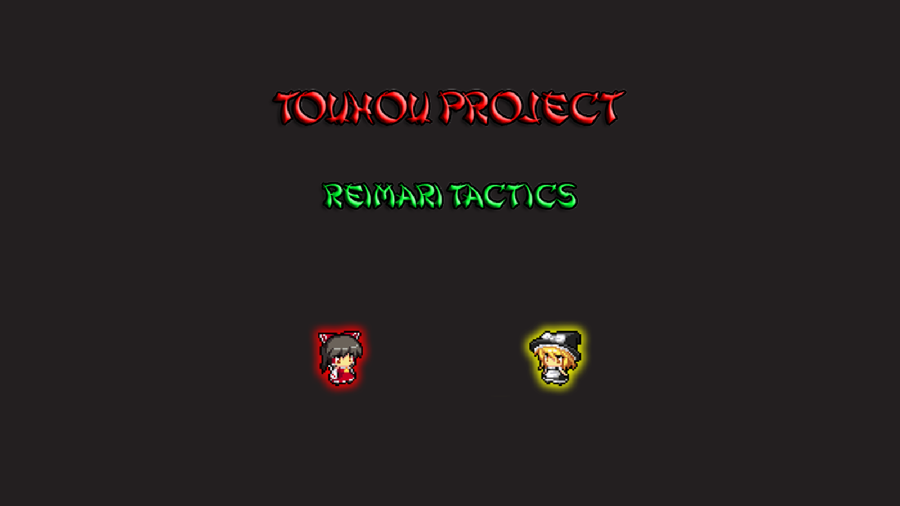

# Touhou Fangame - ReiMari Tactics
Welcome everybody. This repository is to host a little Touhou fangame I made back in 2019. This game is completely free and I don't own anything from Touhou Project mark, all rights are reserved to ZUN and Team Shangai Alice.
- It's a local coop 2D isometric view game up to 2 players at the same time, highly inspired on retro games like Battle City. 
- The plot is simple, Nitori made a new game and Marisa is trying to beat it, then ask Reimu to play with her. 
- The game has five worlds with ten stages each one and autosaves when you clear a stage.
- Default controls for keyboard are arrow keys or WASD to move, aim with the mouse and left click to shoot, right click for bomb and and P to pause the game.
- Second player needs a controller to play, being the left joystick used to move, right joystick to aim and shoot, right bumper for bomb and Start to pause (on a Xbox controller). 

Here's some screenshots played on coop 2:

  

  

  

You can also watch the full coop gameplay if you want [part one here](https://youtu.be/JVXeNmMnQis), [part two here](https://youtu.be/DQC3F8xf5U4), [part three here](https://youtu.be/fXeRQNNF-Mg), [part four here](https://youtu.be/IizENMZfyBU) and [final part here](https://youtu.be/20gyPaka3sI)

  

